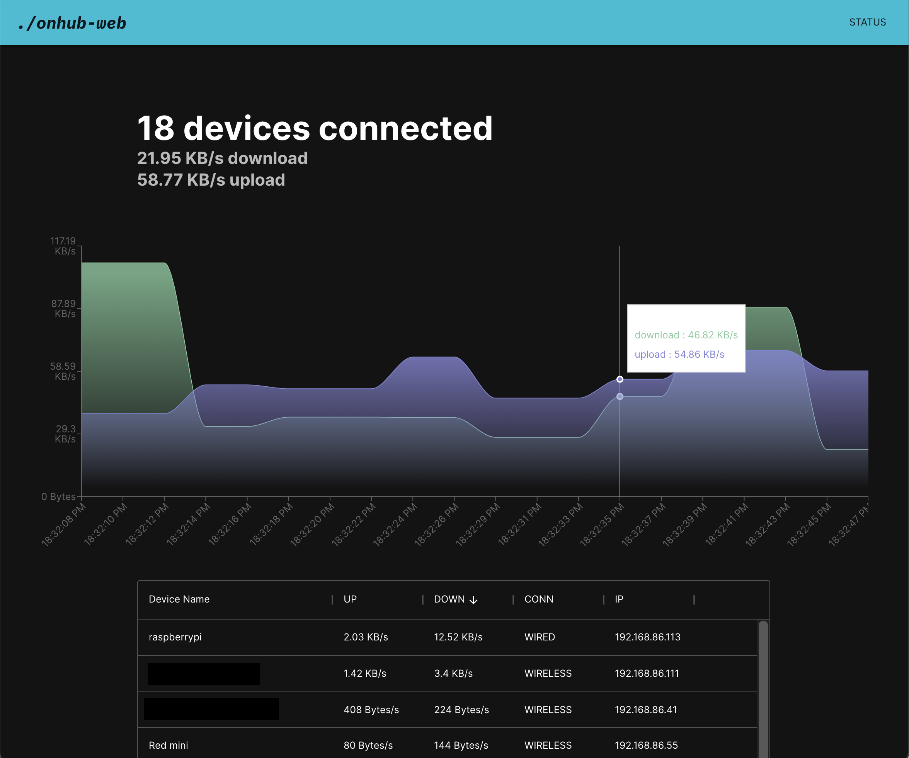
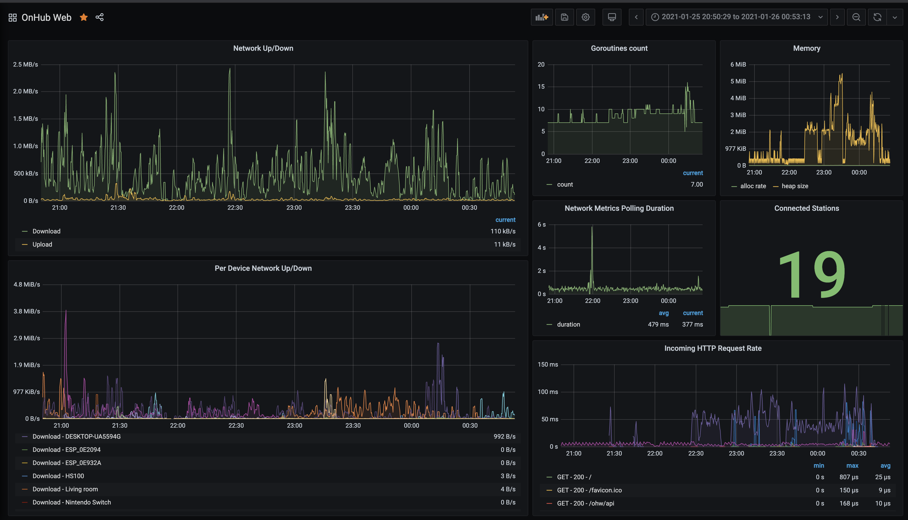

# onhub-web

## About

onhub-web (ohw) is the missing web client for interacting with and monitoring Google OnHub and Google Wifi devices.

onhub-web talks to the [Google Foyer APIs](https://documenter.getpostman.com/view/7490211/SzzdD1pF?version=latest) to retrieve metrics regarding your Google OnHub / Google Home devices. These metrics are then accessible through various avenues including a web UI and Prometheus / Grafana dashboard.



## Getting Started

### Config file

To get started, create a `config.yaml` based on [sample config](./config.sample.yaml).

### Running Locally

```bash
# Download the Node.js dependencies
~/Dev/onhub-web/web ❯ yarn

# Build the frontend client
~/Dev/onhub-web/web ❯ yarn build

# Download Go dependencies
~/Dev/onhub-web ❯ go mod download

# Run the server
~/Dev/onhub-web ❯ go run main.go
```

### Building

```bash
# Build a stand-alone binary (includes web UI)
~/Dev/onhub-web/scripts ❯ ./make.sh

# Build a stand-alone binary (includes web UI) for Raspberry Pi 4
~/Dev/onhub-web/scripts ❯ ./make_pi.sh
```

### Grafana

onhub-web also exposes the metrics through a Prometheus metrics endpoint and a compatible Grafana dashboard is also available.


